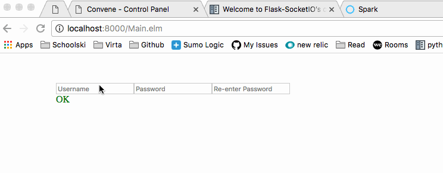
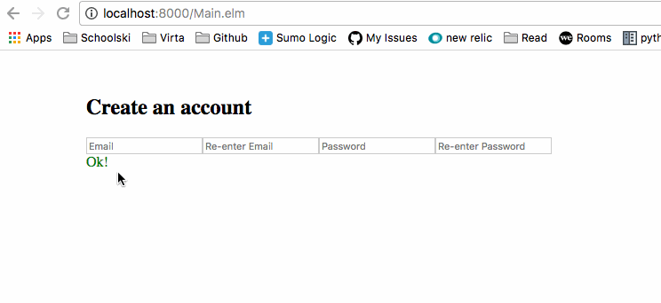

# Elm Workshop

Hello! Today let's play with Elm.
http://elm-lang.org/

# Overview

- View introduction video: https://www.youtube.com/watch?v=vgsckgtVdoQ
- Install elm: `npm install -g elm`
- Start dev server: `elm-reactor`
- Copy code in #Code section of this file into project: pbpaste > Main.elm
- Start improving!

Tip: think data first, change the Model first, not the View.

# Syllabus
## Starting 

Start with our humble create account form. It asks for your username, a password and asks you to confirm your password.



## Milestone #1

(Suggestion to accomplish as a group, lead by teacher)

Business indicates that moving to email (which we'll need to confirm) is the way to go. If you can also add a header, that'd be great. Also, take some time to leave it better than you found it!

- [ ] Change name to email
- [ ] Add confirmation email box
- [ ] Add a header to explain the form
- [ ] The let statement in the `viewValidation` is hiding important business logic! Let's extract it!



## Milestone #2

Suggested with one ore more pairing partner(s)

- [ ] Wait for input into confirmation boxes before saying they don't match
- [ ] Only accept virta health email addresses (something@virtahealth.com)
- [ ] Make sure status is reflective of specific error
- [ ] Adding spacing and visual structure to form
- [ ] Wait till a user enters the confirmation box to test validity
- [ ] Work those HTML/CSS muscles, make the form beautiful 💃


## Milestone 3

Have it your way, baby!

- [ ] Turn this into a react component! (https://github.com/evancz/react-elm-components)
- [ ] Install a live reloader or other debugging tools (elm-live, http://debug.elm-lang.org/)
- [ ] `/=` trips me up, add `!=` as an operator to the program (http://elm-lang.org/docs/syntax)
- [ ] Test the extracted business logic core! (elm-test)
- [ ] ✨ Anything your heart can dream of ✨ (http://stoney.sb.org/eno/oblique.html)

# Starting Code

(From: https://guide.elm-lang.org/architecture/user_input/forms.html)

Copy this code into a text file named `Main.elm` and run `elm-reactor`

```
import Html exposing (..)
import Html.Attributes exposing (..)
import Html.Events exposing (onInput)


main =
  Html.beginnerProgram { model = model, view = view, update = update }


-- MODEL

type alias Model =
  { name : String
  , password : String
  , passwordAgain : String
  }


model : Model
model =
  Model "" "" ""


-- UPDATE

type Msg
    = Name String
    | Password String
    | PasswordAgain String


update : Msg -> Model -> Model
update msg model =
  case msg of
    Name name ->
      { model | name = name }

    Password password ->
      { model | password = password }

    PasswordAgain password ->
      { model | passwordAgain = password }


-- VIEW

view : Model -> Html Msg
view model =
  div []
    [ input [ type_ "text", placeholder "Name", onInput Name ] []
    , input [ type_ "password", placeholder "Password", onInput Password ] []
    , input [ type_ "password", placeholder "Re-enter Password", onInput PasswordAgain ] []
    , viewValidation model
    ]

viewValidation : Model -> Html msg
viewValidation model =
  let
    (color, message) =
      if model.password == model.passwordAgain then
        ("green", "OK")
      else
        ("red", "Passwords do not match!")
  in
    div [ style [("color", color)] ] [ text message ]
```

# Resources

- elm slack: https://elmlang.herokuapp.com/ (very active + helpful!)
- elm subreddit: http://reddit.com/r/elm (same!)
- elm koans: https://github.com/robertjlooby/elm-koans
- install editor plugin (Configure Your Editor - https://guide.elm-lang.org/install.html)

# Troubleshooting

If all else fails, use ellie (https://ellie-app.com/new). but the dev ergonomics are not nearly as good.
